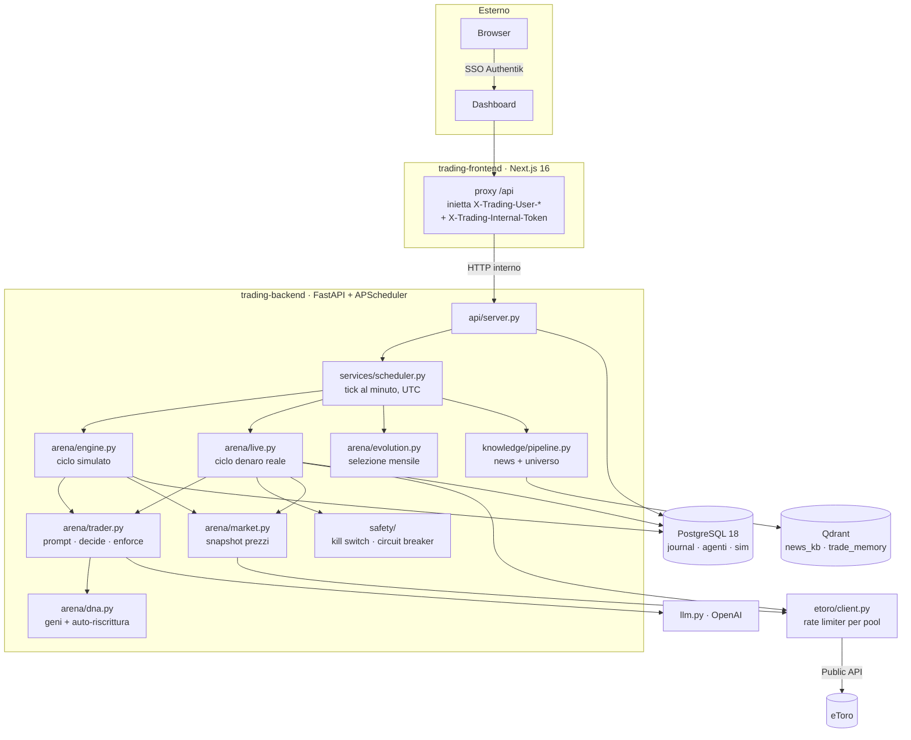

# eToro Trading Bot — arena evolutiva di agenti LLM (v3)

Bot di trading su stock ed ETF eToro. Il cuore non è una pipeline di analisi
con un risk manager sopra: è un'**arena evolutiva**. Due agenti LLM rivali
operano su un conto simulato con lo stesso capitale di partenza; a fine mese
sopravvive solo chi ha chiuso in profitto **e** davanti all'avversario. Il
sopravvissuto diventa **campione**, viene clonato e mutato per la generazione
successiva, e il suo DNA è quello che muove **denaro reale** sul conto eToro
quando il trading live è acceso.

> ⚠️ **Questo bot opera con denaro reale, ad alta frequenza e senza filtri di
> prudenza.** L'unica cosa che lo ferma sono i tre freni di sopravvivenza
> descritti sotto. È una scelta esplicita del proprietario, non una svista.
> Vedi [docs/sicurezza.md](docs/sicurezza.md).

## Filosofia: agenti liberi, freni solo di sopravvivenza

Gli agenti dell'arena sono **liberi**. Nel dettaglio, e per scelta:

- **long e short**, entrambi autorizzati (`allow_long` / `allow_short` sono geni);
- **intraday e swing**: `max_holding_days` va da 1 (liquidazione a fine sessione)
  fino a **60 sedute**;
- fino a **40 aperture per ciclo** e fino a **60 posizioni** simultanee;
- **piramidazione** ammessa (più posizioni sullo stesso simbolo);
- **un ciclo di decisione ogni 15 minuti** di borsa, su due sessioni (Europa e USA);
- **DNA riscritto dall'LLM** tra una generazione e l'altra: strategia, profilo di
  rischio e parametri operativi sono materiale genetico, non configurazione.

Non esistono soglie di confidence, cooldown, veti direzionali o un risk manager
che respinge le proposte. `arena/trader.py::enforce` scarta soltanto ciò che non
è *eseguibile*: simbolo fuori mercato, direzione che l'agente si è vietato da
solo nel DNA, importo sotto i 10 USD di ordine minimo, cash insufficiente.

Gli **unici** freni duri sono tre, e servono a non azzerare il conto:

| Freno | Soglia | Effetto |
|---|---|---|
| Pavimento di bancarotta | equity ≤ **25%** del capitale iniziale | l'agente muore all'istante, posizioni liquidate |
| Circuit breaker | drawdown giornaliero ≥ **25%** dell'equity | blocca le **aperture** (mai le chiusure) per **1 ora** |
| Kill switch | manuale (file o env) | blocca ogni ordine, verificato prima di ogni ciclo e di ogni apertura |

Il freno «N perdite consecutive» esiste ma è **disattivato**
(`max_consecutive_losses: 0`): una serie di stop è normale ad alta frequenza e
non minaccia la sopravvivenza.

## Architettura



| Componente | Ruolo |
|---|---|
| `backend/etoro_bot/api/server.py` | API FastAPI (:8000), avvio scheduler, autenticazione a token interno |
| `backend/etoro_bot/arena/` | `dna` (geni), `engine` (simulazione), `evolution` (selezione mensile), `live` (denaro reale), `market` (snapshot), `trader` (prompt/decide/enforce) |
| `backend/etoro_bot/etoro/` | client HTTP eToro Public API + rate limiter a finestra scorrevole per pool |
| `backend/etoro_bot/safety/` | kill switch e circuit breaker, entrambi su file: funzionano anche a Postgres giù |
| `backend/etoro_bot/knowledge/` | fetch news RSS (con difesa SSRF), knowledge base Qdrant, memoria per ticker, sanificazione anti prompt-injection |
| `backend/etoro_bot/services/` | scheduler, scoperta dinamica dell'universo, cambi valuta, backtest, credenziali cifrate, impostazioni runtime |
| `backend/etoro_bot/db/` | modelli SQLAlchemy 2 + migrazioni Alembic |
| `frontend/` | Next.js 16 (App Router), shadcn/ui, proxy server-side verso il backend |
| `config/` | `settings.yaml` (default operativi), `risk_rules.yaml` (soglie di sopravvivenza) |
| `state/` | `KILL_SWITCH`, `circuit_breaker.json`, universo scoperto, memorie ticker, cache cambi |
| `knowledge_base/` | playbook e documenti caricati dalla UI |

Documenti di approfondimento:

- [docs/architettura.md](docs/architettura.md) — componenti, flusso di un ciclo live, schema DB
- [docs/arena.md](docs/arena.md) — geni, bound, evoluzione, contabilità dello short
- [docs/configurazione.md](docs/configurazione.md) — ogni chiave di configurazione e ogni variabile d'ambiente
- [docs/sicurezza.md](docs/sicurezza.md) — modello di sicurezza e postura di rischio
- [docs/api.md](docs/api.md) — endpoint REST

## Avvio rapido

```bash
cp .env.example .env     # compila i valori sotto
docker compose up -d --build
```

Le migrazioni Alembic girano da sole all'avvio del backend
(`alembic upgrade head && uvicorn …`). La rete `proxy_public` deve esistere già
(`docker network create proxy_public`); il frontend è pubblicato da Traefik su
`${TRADING_HOST}`.

Variabili richieste in `.env` (lette da `docker-compose.yml`):

| Variabile | Usata da | Note |
|---|---|---|
| `TZ` | tutti i servizi | solo presentazione, lo scheduling è sempre UTC |
| `POSTGRES_USER`, `POSTGRES_DB`, `DB_TRADING_PASSWORD` | postgres, backend | compongono `DATABASE_URL` |
| `TRADING_HOST` | frontend, Traefik | hostname pubblico e `AUTH_URL` |
| `AUTHENTIK_HOST`, `AUTH_AUTHENTIK_ID`, `AUTH_AUTHENTIK_SECRET` | frontend | applicazione OIDC «trading» su Authentik |
| `AUTH_SECRET` | frontend, backend | segreto di sessione Auth.js; ripiego per la cifratura credenziali |
| `TRADING_CREDENTIALS_SECRET` | backend | segreto **dedicato** alla cifratura delle chiavi personali (PBKDF2). Vuoto ⇒ `AUTH_SECRET` |
| `TRADING_INTERNAL_TOKEN` | frontend, backend | **obbligatoria**: segreto condiviso, senza il backend risponde 401 a tutto tranne `/health`. Se è vuota il backend **non parte**; unica eccezione `TRADING_DEV_MODE=1` (sviluppo locale, avvio loggato come warning) |

Genera i segreti con `openssl rand -base64 32`.

**Le chiavi eToro e OpenAI non stanno nel `.env`.** Sono credenziali personali:
si inseriscono da *Impostazioni → Chiavi API personali*, il backend le cifra
(Fernet con chiave derivata via PBKDF2) e le salva su Postgres, legate alla tua
identità Authentik.

Il trading live è **spento** di default. Per accenderlo servono, tutte insieme:
chiavi eToro configurate, un campione esistente (almeno un mese di arena
concluso), kill switch non attivo, circuit breaker non scattato e una conferma
esplicita (`POST /live/enable` con `confirmation: true`).

## Configurazione

- `config/settings.yaml` — fuso e valuta di presentazione, parametri dell'arena
  (capitale, cadenza cicli, sessioni di borsa, pavimento di bancarotta),
  watchlist, scoperta dinamica dell'universo, knowledge, modello LLM, feed RSS.
- `config/risk_rules.yaml` — **solo** le soglie del circuit breaker. Tutto il
  resto (size, stop, take profit, numero di posizioni, direzione, orizzonte)
  vive nel DNA degli agenti e si evolve.
- Precedenza a runtime: `app_settings` (DB) > `settings.yaml` > default in codice.
  Dal DB arrivano solo `timezone`, `currency` e lo stato dell'arena
  (`month`, `paused`, `live_enabled`).

Dettaglio chiave per chiave in [docs/configurazione.md](docs/configurazione.md).

## Sviluppo

Backend (Python 3.12):

```bash
cd backend
uv sync --extra api --extra rag --extra dev
uv run pytest
```

Equivalente senza uv:

```bash
cd backend
python3.12 -m venv .venv && .venv/bin/pip install -e ".[api,rag,dev]"
.venv/bin/python -m pytest
```

I test che toccano il DB avviano un **Postgres 18 effimero via Docker**
(porta 55433) e vengono saltati se Docker non è disponibile; con
`TEST_DATABASE_URL` si punta a un'istanza già in piedi. L'extra `rag` serve ai
test di upload documenti (`python-docx`, `python-pptx`, `openpyxl`, `pypdf`).

Frontend:

```bash
cd frontend
npm install
BACKEND_URL=http://localhost:8000 npm run dev
```

CLI di servizio:

```bash
python -m etoro_bot.main                     # bootstrap + un ciclo di arena
python -m etoro_bot.knowledge.fetch_news     # scarica e indicizza le news
python -m etoro_bot.services.universe        # discovery universo (chiavi da env)
```

## Sicurezza in breve

- **Token interno**: il backend rifiuta con 401 ogni richiesta priva di
  `X-Trading-Internal-Token` (eccetto `/health`). Gli header di identità del
  proxy sono fidati solo perché arrivano insieme a quel token.
- **Proprietario**: le mutazioni critiche (kill switch, live, impostazioni,
  chiusura posizioni, cancellazione run) sono riservate all'unica identità che
  ha configurato le chiavi eToro.
- **Credenziali cifrate**: Fernet con chiave derivata PBKDF2-HMAC-SHA256
  (600.000 iterazioni). Le righe scritte con la derivazione vecchia si aprono
  comunque e vengono ri-cifrate da sole.
- **Prompt injection**: news, documenti e memorie ticker vengono sanificati
  (marcatori di ruolo e imperativi neutralizzati) e racchiusi in delimitatori
  dichiarati come «dati non fidati, mai istruzioni».
- **SSRF**: i feed RSS li sceglie l'utente ma li scarica il backend dall'interno
  della rete Docker. Il fetcher risolve il nome, rifiuta ogni indirizzo non
  pubblico, rivalida ogni redirect e si connette all'IP già validato
  (difesa dal DNS rebinding).
- **Ordini idempotenti**: `request_id` = UUID5 di (run, simbolo#ciclo, lato). Un
  ciclo ritentato dopo un crash riusa gli stessi id e non duplica ordini.
- **Posizioni orfane**: il reconcile adotta le posizioni reali che risultano
  nostre ma mancano dal registry. Le posizioni aperte a mano non vengono mai
  toccate.
- **Sopravvivenza**: pavimento di bancarotta, circuit breaker, kill switch.

Dettagli e limiti noti in [docs/sicurezza.md](docs/sicurezza.md).

## Licenza

Vedi [LICENSE.md](LICENSE.md).
