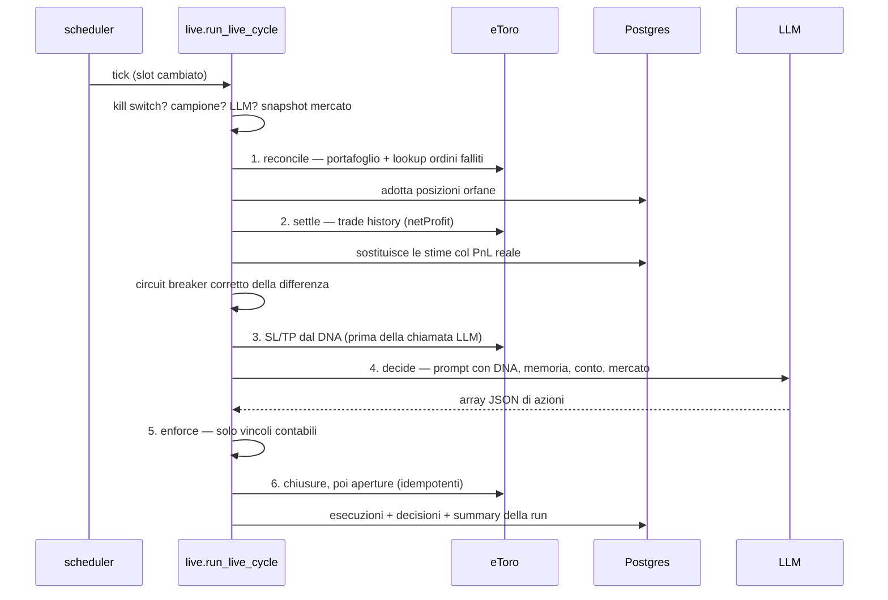

# Architettura

## Servizi

Quattro container (`docker-compose.yml` alla radice del repo):

| Servizio | Immagine | Rete | Note |
|---|---|---|---|
| `trading-postgres` | `postgres:18-alpine` | `trading_internal` | journal, agenti, conti simulati. Volume `./data/postgres` |
| `trading-qdrant` | `qdrant/qdrant:latest` | `trading_internal` | knowledge base vettoriale. Volume `./data/qdrant` |
| `trading-backend` | build `./backend` | `trading_internal` | FastAPI :8000 + APScheduler. Non esposto a Traefik |
| `trading-frontend` | build `./frontend` | `proxy_public`, `trading_internal` | Next.js :3000, unico servizio pubblicato |

Il backend non è raggiungibile da fuori: si arriva solo passando dal proxy del
frontend, che aggiunge lato server l'identità e il token interno.

## Moduli del backend

```
etoro_bot/
├── api/server.py          API REST + avvio scheduler + job di sistema
├── arena/
│   ├── dna.py             geni, bound, clamp, mutazione (auto-riscrittura LLM)
│   ├── engine.py          ciclo di trading simulato, bancarotta, riflessione EOD
│   ├── evolution.py       selezione mensile, morte, clonazione
│   ├── live.py            ciclo su denaro reale, reconcile, settle, esecuzione
│   ├── market.py          snapshot di mercato (prezzi, metriche, memoria news)
│   └── trader.py          costruzione prompt, parsing azioni, enforce contabile
├── etoro/
│   ├── client.py          eToro Public API (market-data, trading info, execution)
│   └── rate_limiter.py    finestra scorrevole per pool, 80% del budget
├── knowledge/
│   ├── fetch_news.py      RSS/Atom con stdlib, via safe_fetch
│   ├── safe_fetch.py      difesa SSRF + DNS rebinding
│   ├── kb.py              Qdrant: news_kb, trade_memory, decadimento per recency
│   ├── ingest.py          upload documenti → chunk → indice
│   ├── parsers.py         pdf/docx/pptx/xlsx/md/txt
│   ├── ticker_memory.py   memoria evolutiva per titolo
│   ├── tickers.py         rilevamento ticker nel testo
│   ├── untrusted.py       sanificazione + delimitatori anti prompt-injection
│   └── pipeline.py        fetch → indicizza → pota → memorie → universo
├── safety/
│   ├── kill_switch.py     file KILL_SWITCH o ETORO_BOT_KILL=1
│   └── circuit_breaker.py stato JSON persistente, istanza condivisa per processo
├── services/
│   ├── scheduler.py       tick al minuto in UTC, sessioni di borsa, slot dei cicli
│   ├── universe.py        scoperta dinamica dell'universo (scout LLM + regex)
│   ├── backtest.py        metriche TWR + benchmark
│   ├── fx.py              cambi USD→valuta (Frankfurter), solo presentazione
│   ├── app_settings.py    impostazioni runtime + guardrail attivazione live
│   └── user_credentials.py cifratura chiavi personali
├── db/
│   ├── models.py          modelli SQLAlchemy 2
│   ├── repo.py            repository (unico punto di accesso al DB)
│   └── migrations/        Alembic
├── config.py              caricamento YAML, senza dipendenze dal DB
├── domain.py              Side, ExecutionStatus, ExecutionResult, order_request_id
├── llm.py                 chiamata OpenAI + estrazione JSON robusta
└── main.py                CLI: bootstrap + un ciclo di arena
```

## Scheduler

`services/scheduler.py` avvia un solo job APScheduler, un **tick al minuto in
UTC**, che rilegge le impostazioni a ogni giro. Ogni job lungo parte in un
thread dedicato e non viene mai eseguito in due istanze sovrapposte.

Cosa fa il tick:

1. **Evoluzione** — al primo tick di ogni giorno chiama `bootstrap_if_needed` +
   `maybe_evolve` (no-op se il mese non è cambiato).
2. Nei fine settimana (sabato/domenica UTC) si ferma qui.
3. **News** — una volta al giorno, 30 minuti prima della prima apertura.
4. **Ciclo di trading** — quando cambia lo slot del ciclo, cioè ogni
   `arena.cycle_minutes` (default 15) mentre almeno una sessione è aperta.
   Esegue sempre il ciclo di training e, se `live_enabled`, anche il ciclo live.
5. **Fine sessione** — alla chiusura di ciascun mercato chiude le posizioni di
   *quel* mercato che hanno esaurito il `max_holding_days` del DNA. Alla
   chiusura dell'ultima sessione del giorno partono anche la riflessione serale
   degli agenti e lo snapshot dell'equity.

Sessioni di default (UTC, orari estivi): `europe` 07:00–15:30,
`usa` 13:30–20:00. Sono configurabili in `arena.markets`.

Lo **slot del ciclo** (`cycle_slot_key`) è `YYYYMMDD#<indice>`, dove l'indice si
conta dalla prima apertura del giorno. È la base delle chiavi di idempotenza
degli ordini: un ciclo che va in crash e viene ritentato nella stessa finestra
produce gli stessi `request_id`. A mercati chiusi l'indice si calcola comunque,
da mezzanotte UTC, con prefisso `off`.

## Snapshot di mercato

`arena/market.py::build_snapshot` costruisce `symbol → {instrument_id, price,
market, day_pct, week_pct, sma20_dist_pct, view}`:

- universo = watchlist + titoli scoperti dinamicamente
  (`services/universe.effective_universe`), troncato a `arena.max_symbols` (80);
- con `only_open=True` (default nei cicli) restano solo i titoli la cui borsa è
  aperta adesso; gli EOD usano `only_open=False` per avere il prezzo di chiusura;
- catalogo eToro per tipo strumento (5 = azioni, 6 = ETF), poi prezzi correnti
  (`lastExecution` → `bid` → `ask`);
- le **candele giornaliere sono in cache per un'ora**: con cicli da 15 minuti
  la cache copre comunque tre cicli su quattro, e rileggerle ogni volta
  costerebbe una quota inutile del budget del pool market-data;
- ogni riga porta un estratto della memoria news del titolo, sanificato e
  marcato come non fidato.

## Flusso di un ciclo LIVE

`arena/live.py::run_live_cycle`, sotto lock esclusivo (`_live_lock`, non
bloccante: se un ciclo è in corso questo viene saltato).



Nel dettaglio:

1. **Reconcile** (`reconcile_live_positions`) — il registry deve rispecchiare il
   conto *prima* di qualsiasi decisione. Due sorgenti: esecuzioni marcate
   `failed` che portano il reference id di un ordine che il broker considera
   invece eseguito, e posizioni del portafoglio il cui `positionId` compare già
   nel giornale delle esecuzioni. Le posizioni che il bot non ha aperto non
   vengono mai toccate: qui si adotta soltanto, non si chiude nulla. La
   riverifica degli ordini falliti è limitata alle ultime 24 ore.
2. **Settle PnL** (`settle_pending_closes`) — quando parte un ordine di
   chiusura il PnL reale non è ancora in trade history: la posizione viene
   chiusa a registro con una **stima mark-to-market** e marcata `pnl_settled =
   false`. Questa passata cerca il `netProfit` del broker, sostituisce la stima
   e passa al circuit breaker **solo la differenza**, così il drawdown converge
   sul dato vero senza contare due volte lo stesso trade. Dopo 7 giorni senza
   pubblicazione la chiusura viene chiusa con la stima e un warning.
3. **Sweep stop loss / take profit** — le soglie sono geni del DNA del campione
   (`stop_loss_pct`, `take_profit_pct`; a 0 sono disattivate). Girano **prima**
   della chiamata all'LLM: un modello lento non deve poter ritardare uno stop.
   La variazione % è calcolata secondo la direzione reale della posizione
   (campo `isBuy` del portafoglio eToro). Una chiusura che fallisce non
   impedisce le altre.
4. **Decide** — `trader.build_prompt` + `trader.decide`. Un'unica chiamata LLM
   per ciclo, risposta attesa come array JSON di
   `{action, symbol, direction, size_pct, reason}`. Qualsiasi errore ⇒ nessuna
   azione (lista vuota), non un'eccezione.
5. **Enforce** — `trader.enforce` traduce le azioni in ordini eseguibili
   applicando solo i vincoli contabili e i tetti che l'agente si è dato nel DNA.
   Vedi [arena.md](arena.md#enforce-cosa-viene-davvero-scartato).
6. **Esecuzione** — prima le chiusure (che passano *sempre*, anche a breaker
   scattato), poi le aperture. Ogni apertura verifica kill switch e circuit
   breaker; se bloccata viene contata in `blocked`. Le aperture usano
   `request_id = UUID5(run_id, "symbol#slot", side)`. Se `open_position`
   solleva, il codice interroga il broker su quel reference id: se l'ordine
   risulta eseguito la posizione viene **adottata** invece che persa; altrimenti
   l'esecuzione va a giornale come `failed` **con il reference id nel dettaglio**,
   così il reconcile del ciclo successivo può ancora recuperarla.
   Uno short che il client non sa inviare viene registrato come `skipped`, mai
   convertito silenziosamente in long.
7. **Giornale** — ogni azione (apertura e chiusura) finisce in `decisions` con
   stage `trader`; il summary della run finisce in `runs.summary_json`.

Fine sessione (`close_live_market_positions`) ed EOD (`run_live_eod`) prendono
lo **stesso lock**, con attesa fino a 10 minuti: la campanella non si salta.

## Flusso di un ciclo di TRAINING

`arena/engine.py::run_training_cycle`, sotto lock non bloccante `_cycle_lock`.
Salta tutto se l'arena è in pausa.

Per ogni agente vivo:

1. `bootstrap_if_needed` crea la generazione se non c'è nessun agente vivo;
2. chiusure automatiche da stop loss / take profit del DNA;
3. prompt → `decide` → `enforce`, con cash ed equity riletti dopo le chiusure;
4. chiusure richieste dall'LLM (con filtro opzionale di direzione), poi aperture;
5. snapshot dell'equity in `sim_equity`;
6. `_enforce_survival_floor`: se l'equity è scesa al pavimento di bancarotta
   l'agente viene liquidato e ucciso all'istante, con evento `death`.

All'ultima campanella del giorno `run_eod` fotografa l'equity e fa **riflettere**
ogni agente: l'LLM riscrive il diario (max 10 punti) a partire dal PnL di
giornata e dai trade recenti. La memoria persistita è
`credo di sopravvivenza + "DIARIO:" + diario`, troncata a 8000 caratteri.

### Training e live a confronto

| | Training (arena) | Live |
|---|---|---|
| Chi decide | i due agenti vivi | il **campione** |
| Denaro | conto simulato in tabella | conto eToro reale |
| Capitale | `arena.starting_capital_eur` convertito in USD | quello che c'è sul conto |
| Prezzi | stesso snapshot di mercato del live | stesso snapshot |
| Short | prezzo specchiato nel libro mastro (vedi [arena.md](arena.md#contabilità-dello-short)) | ordine `transaction: sell` verso eToro |
| Freni | pavimento di bancarotta | kill switch + circuit breaker |
| Reconcile / settle | non serve (nessun broker) | sì |
| Quando gira | sempre (se non in pausa) | solo se `live_enabled` |

Entrambi i cicli girano nello stesso tick e condividono lo **stesso snapshot di
mercato**, costruito una volta sola dal job dello scheduler.

## Pipeline news e universo dinamico

`knowledge/pipeline.py::run_news_pipeline` è l'unico ingresso, usato sia dal job
schedulato sia dal fetch manuale. Quattro effetti, ognuno degradabile
indipendentemente:

1. indicizzazione delle news in `news_kb` (con timestamp per il decadimento);
2. purge delle news oltre `knowledge.news_max_age_days` (45 giorni);
3. aggiornamento delle memorie per ticker;
4. refresh dell'universo dinamico, se un client eToro è disponibile.

La discovery (`services/universe.py`) usa uno **scout LLM** come segnale
primario: legge un digest delle news del giorno (sanificato, interleaved per
fonte) e propone titoli con tesi e confidence. Le citazioni esplicite trovate
con regex fanno da corroborazione e da fallback automatico se l'LLM non è
disponibile. Ogni proposta deve poi risolversi sul catalogo eToro e superare uno
**screening deterministico**: prezzo minimo, storico minimo, liquidità,
volatilità annualizzata, spread. C'è un'isteresi anti-churn: un titolo già
dentro resta per `keep_misses - 1` refresh senza riconferma, purché continui a
superare lo screening.

## Schema del database

Journal e stato operativo (`db/models.py`). Le PK delle righe append-only usano
`uuidv7()` nativo di PostgreSQL 18: ordinabili temporalmente.

| Tabella | Chiave | Contenuto |
|---|---|---|
| `runs` | `run_id` (es. `live-20260730`) | anagrafica della run, `environment`, `summary_json` |
| `decisions` | uuidv7 | azione proposta dall'agente, `stage`, `payload` JSONB |
| `executions` | uuidv7 | esito ordine: `side`, `amount_usd`, `status` (`filled`/`failed`/`skipped`/`rejected`), `detail`, `execution_price`, `etoro_position_id` |
| `bot_positions` | `etoro_position_id` | **solo** le posizioni aperte dal bot. Include `close_order_id` e `pnl_settled` per la liquidazione differita del PnL |
| `equity_snapshots` | `date` | equity/cash/esposizione a fine giornata (conto reale) |
| `app_settings` | `key` | impostazioni runtime (`timezone`, `currency`, `arena`, feed RSS per utente) |
| `settings_audit` | uuidv7 | storico dei cambi di impostazione |
| `agents` | uuidv7 | agente dell'arena: `dna` JSONB, `memory`, `status`, `is_champion`, `parent_id`, `generation`, `month`, `starting_capital_usd`, `cash_usd` |
| `sim_positions` | uuidv7 | posizioni aperte del conto simulato (con `units`, `open_reason`) |
| `sim_trades` | uuidv7 | round-trip chiusi del conto simulato, con `pnl_usd` |
| `sim_equity` | uuidv7 | serie equity del conto simulato |
| `arena_events` | uuidv7 | `birth`, `death`, `evolution`, `pause`, `resume`, `live_on`, `live_off`, `error` |
| `user_credentials` | `user_id` | chiavi eToro/OpenAI cifrate, per identità Authentik |

Migrazioni presenti: schema iniziale, rimozione della colonna `mode` da `runs`,
credenziali utente, tabelle arena, aggiunta di `close_order_id` / `pnl_settled`
a `bot_positions`, eliminazione della tabella `risk_scores` (mai alimentata).

Il registry `bot_positions` è l'unica fonte per dashboard, storico e backtest:
**le posizioni aperte a mano su eToro non entrano mai** nei conteggi del bot.

## Stato su file

`state/` (montato come `/app/state`) contiene ciò che deve sopravvivere anche a
Postgres giù o a un riavvio:

- `KILL_SWITCH` — presenza del file = tutto bloccato;
- `circuit_breaker.json` — stato del breaker (giorno, PnL giornaliero, cooloff);
- `discovered_universe.json` — universo dinamico corrente;
- `ticker_memory/{TICKER}.json` — memoria evolutiva per titolo;
- `fx_rates.json` — cache dei cambi;
- `users/<hash>/` — marcatore ultimo fetch news e ultime news per utente.
